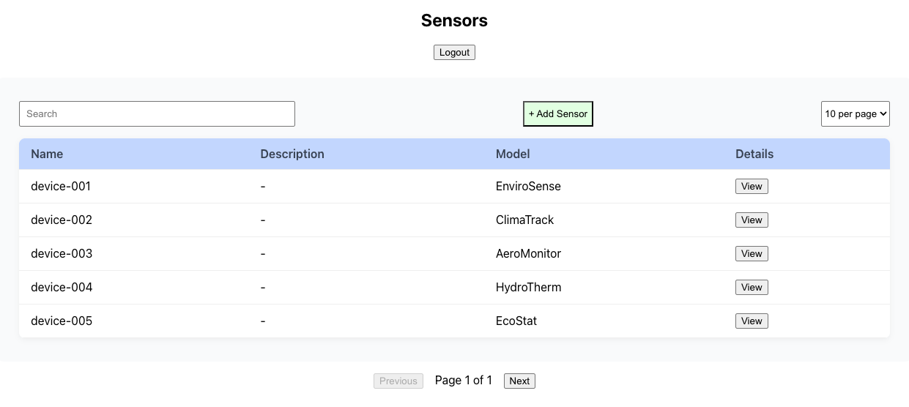
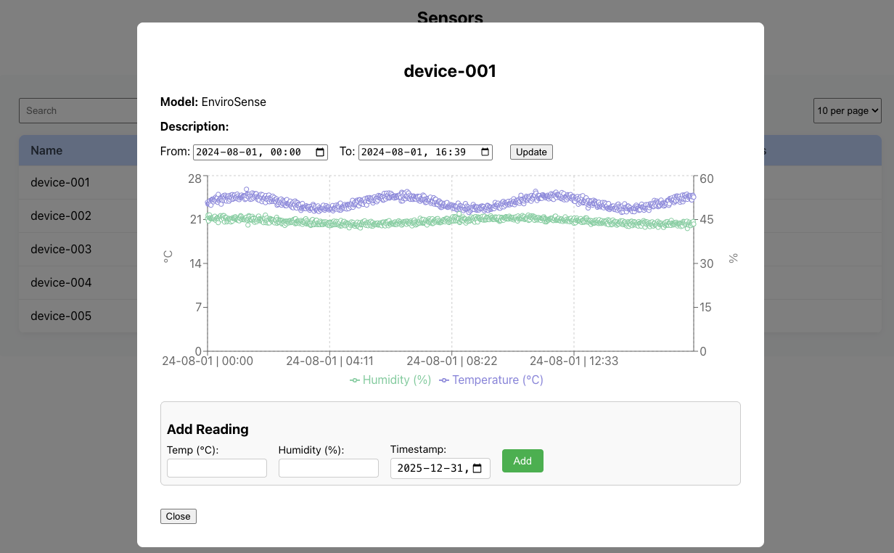

# Weather Sensor Manager

## Description
Built a full-stack web application that allows users to manage weather sensors and track readings (temperature, humidity). The backend is implemented with Django and PostgreSQL, and the frontend with React. Each service runs in its own Docker container.

The project was completed within 10 days, demonstrating full-stack development, REST API integration, and containerization.




## Tech Stack
- PostgreSQL
- Django
- React
- Docker
- REST APIs

## Setup / How to Run
*This project runs locally using Docker Compose - a deployed version is currently not available.*

1. In the root directory, create an `.env` file with the following contents:

```
POSTGRES_DB=pgname
POSTGRES_USER=pguser
POSTGRES_PASSWORD=pgpassword
```

2. Open a command line tool in the root directory and run the following commands:

```
make up           - Build and run containers
make migrate      - Run database migrations
make seed         - Populate the database
make test         - Run unit tests
```

3. Go to http://localhost:3000/login to either:
- log in with pre-existing user (username: jocke, password: test123) or register a new user
- currently supported routes: /login, /register, /sensors

## Link to OpenAPI docs:
http://localhost:8000/api/docs